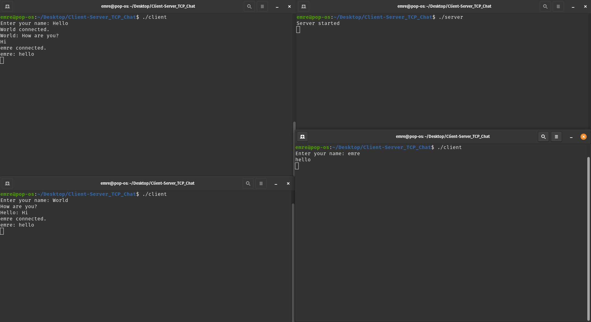

 
 # Client-Server_TCP_Chat
 
- Constructed in C++ utilizing socket programming principles and multi-threading techniques

* basicTCP.cpp

- It is a basic C++ TCP application that demonstrates the foundational steps for creating a TCP client, including creating a socket, connecting to a server, sending data, and receiving data over a network using the TCP/IP protocol. 

* How to run?
	
	1. Clone and cd to “Client-Server_TCP_Chat” and run the following commands:

			g++ server.cpp -o server -pthread
 			g++ client.cpp -o client -pthread

  	2. Run the server:

  			./server

   	3. Run the client:

  			./client

